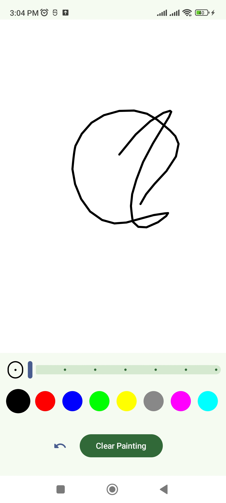
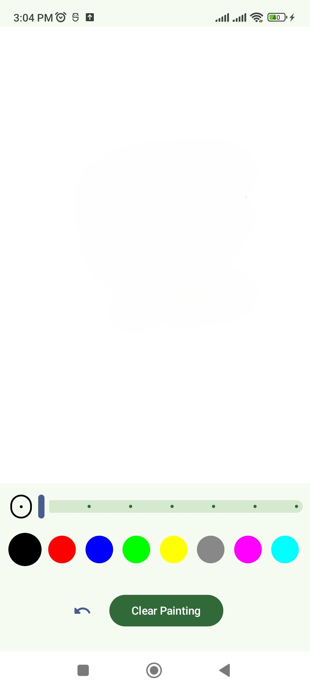
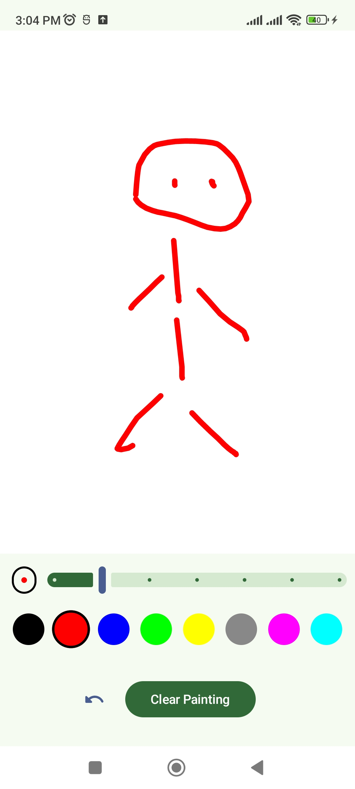
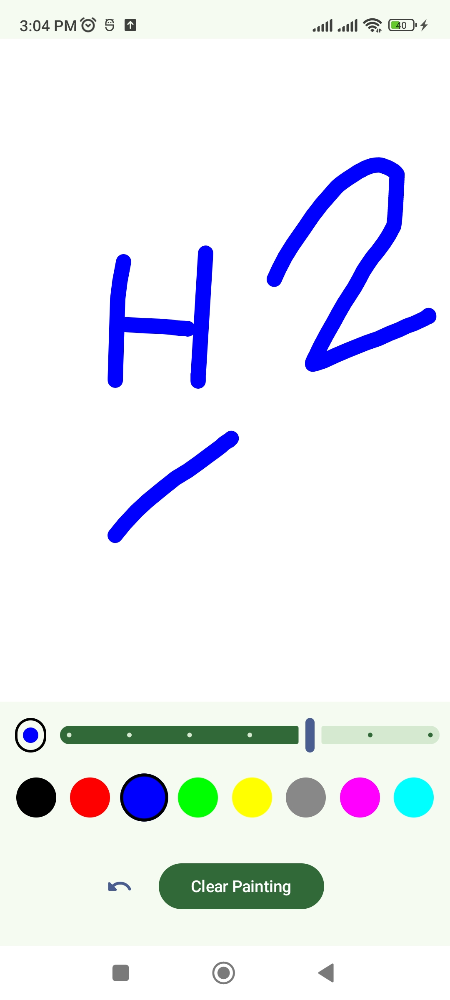

# Draw App BM

A modern, intuitive drawing application for Android built using **Jetpack Compose** and **Material 3**. This app provides a smooth drawing experience with customizable brushes and colors.

## 📸 Screenshots

<p align="center">
  
  
  
  

</p>

## ✨ Features

- **Smooth Freehand Drawing:** High-performance canvas with quadratic curve smoothing for a natural feel.
- **Adjustable Brush Size:** Easily change the thickness of your strokes using a slider with a real-time preview circle.
- **Vibrant Color Palette:** Choose from multiple colors (Black, Red, Blue, Green, Yellow, Gray, Magenta, Cyan) to bring your creations to life.
- **Undo Functionality:** Made a mistake? Quickly undo your last stroke.
- **Clear Canvas:** Reset your workspace instantly with the "Clear Painting" button.
- **Modern UI:** Built with Material 3 components for a clean and responsive look.

## 🛠 Tech Stack

- **Language:** [Kotlin](https://kotlinlang.org/)
- **UI Framework:** [Jetpack Compose](https://developer.android.com/jetpack/compose)
- **Architecture:** MVVM (Model-View-ViewModel)
- **State Management:** StateFlow & Lifecycle-aware components
- **Design System:** Material 3

## 🚀 Getting Started

1.  **Clone the repository:**
    ```bash
    git clone https://github.com/yourusername/DrawAppBM.git
    ```
2.  **Open in Android Studio:**
    - Use Android Studio Ladybug or newer.
3.  **Build and Run:**
    - Connect an Android device or start an emulator.
    - Click the **Run** button in Android Studio.

## 📂 Project Structure

- `MainActivity.kt`: The main entry point and UI layout.
- `DrawingCanvas.kt`: The custom drawing component handling touch events and rendering.
- `DrawingViewModel.kt`: Manages the application state and drawing logic.
- `ui.theme/`: Contains the theme, color, and typography definitions.

---
Developed by BM.
